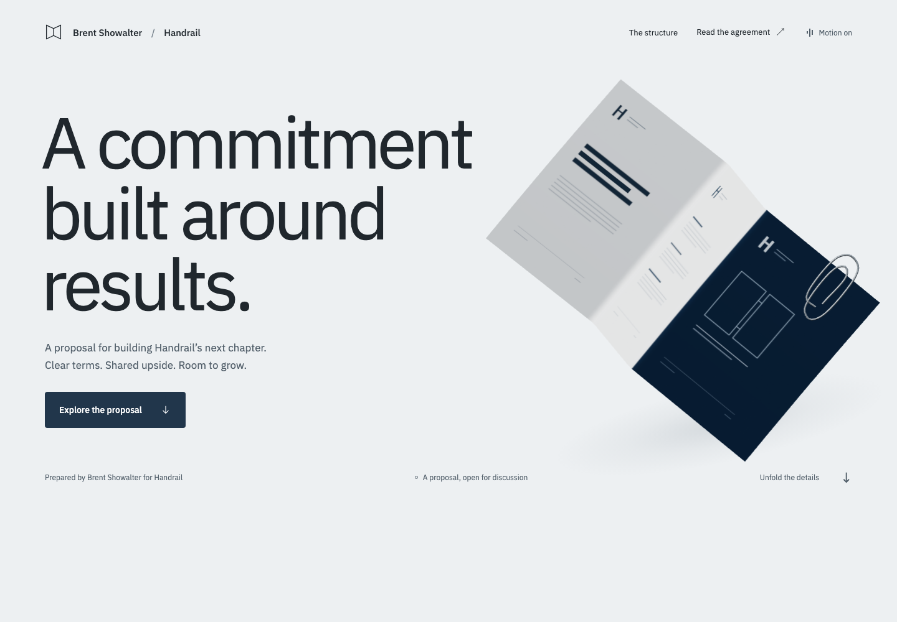

# Handrail proposal

An interactive agreement for Brent Showalter and Handrail. A folded paper sculpture opens as the reader explores two ways to begin a working relationship, then gives way to the complete proposed contract.



**Implemented for local preview. Public deployment is pending.** This is an unsigned proposal; reading, interacting with or downloading it does not accept its terms.

## The experience

The proposal compares employment first at **15% of collected build fees plus 5% recurring**, with a qualifying client first at **20% plus 5% recurring**. It explains the activation window, collection-based payments, responsibilities and outstanding details before presenting the agreement in full.

The visual system comes from the document itself: cool white paper, graphite type, deep navy and the light across a physical crease. The original 3D sheet uses continuous procedural geometry, printed linework and a modeled silver paperclip. Scroll progress unfolds the same object; the scene does not run a continuous idle animation.

Readers can go directly to the agreement, disable animation or download the PDF. The essential content is semantic HTML. A static paper illustration preserves the composition without JavaScript or WebGL, and reduced-motion preferences are respected.

## Engineering

| Responsibility | Implementation |
| --- | --- |
| Pages and content | Astro static output with strict TypeScript and React islands. No backend, accounts, analytics or electronic signing. |
| Agreement source | `src/content/proposal.ts` defines the public terms and clauses. HTML, generated Markdown and the PDF follow this source. |
| Contract behavior | `src/lib/agreement.ts` models activation and timing rules for scenario tests. It does not execute a contract or process customer records. |
| Paper scene | React Three Fiber and Three.js. Existing geometry buffers update with progress; rendering runs on demand, with a capped pixel ratio and visibility-aware updates. No external 3D assets or environment requests. |
| Scroll coordination | GSAP ScrollTrigger connects the scene, timeline and payment explanation. Lenis runs on desktop with a fine pointer; touch devices retain native scrolling. |
| Typography | Locally served IBM Plex Sans. |
| Components and verification | Storybook stories, Vitest contract scenarios, Playwright browser flows and axe accessibility checks. |

The PDF is printed from the agreement route rather than maintained as an independent copy. Regenerate it after editing the canonical content; a previously generated PDF does not update itself.

## Run locally

Use Node **22.18 or later** and the pnpm version declared in `package.json`.

```sh
pnpm install --frozen-lockfile
pnpm dev
```

Open [the local proposal](http://127.0.0.1:4321/handrail-proposal/) or [the agreement](http://127.0.0.1:4321/handrail-proposal/agreement/).

To inspect a production build, stop any process already using the preview port, then run:

```sh
pnpm build:release
pnpm preview --port 4321
```

The `/handrail-proposal/` base path is intentional. Keep it when checking direct links, assets and downloads.

## Verify

```sh
pnpm check
pnpm test
pnpm build:release
pnpm pdf:check
pnpm build-storybook
```

Install Chromium once, then run browser tests (the test runner starts a static preview when needed):

```sh
pnpm exec playwright install chromium
pnpm test:e2e
```

The PDF verifier requires Poppler (`brew install poppler` on macOS, `poppler-utils` on Ubuntu). `pnpm build:release` builds HTML and generates the PDF together; `pnpm pdf:check` independently compares extracted PDF text with the canonical clauses.

Use `pnpm storybook` for the component workshop at [localhost:6006](http://127.0.0.1:6006/). Browser scenarios cover the agreement and download, canonical clause content, responsive layouts, keyboard navigation, persisted motion preferences, reduced motion, JavaScript-disabled reading, WebGL fallback and accessibility scans.

With Storybook running, `pnpm test:components` exercises the component states. `pnpm capture` and `pnpm performance` use the app preview on port 4321.

Generated reports and screenshots stay in ignored artifact directories. The image above is a browser capture from the verified local build. Consult the [implementation record](IMPLEMENTATION.md) and [local workflow evidence](docs/local-workflow.md) for completed checks and remaining work.

## Design and authorship

Brent supplied the business intent and proposal decisions. AI tools assisted design, implementation and review. Verification is recorded separately from generation; using a tool does not itself establish a successful result.

[DESIGN.md](DESIGN.md) records the visual direction and references. The geometry and page composition were created for this project. Lusion informed the approach to materials and dimensional craft; Exat informed typographic scale and pacing. No assets from those sites are included.

GitHub Pages publication uses the tested static build on the `gh-pages` branch. The optional Actions templates are preserved under `docs/github-actions/`; the current GitHub credential has no workflow-write permission, so those templates are inactive. Validation runs locally before a publishing push. The [GitHub showcase handoff](docs/github-showcase.md) covers the profile README, project pins and post-publication checks. No live production URL is claimed here.
